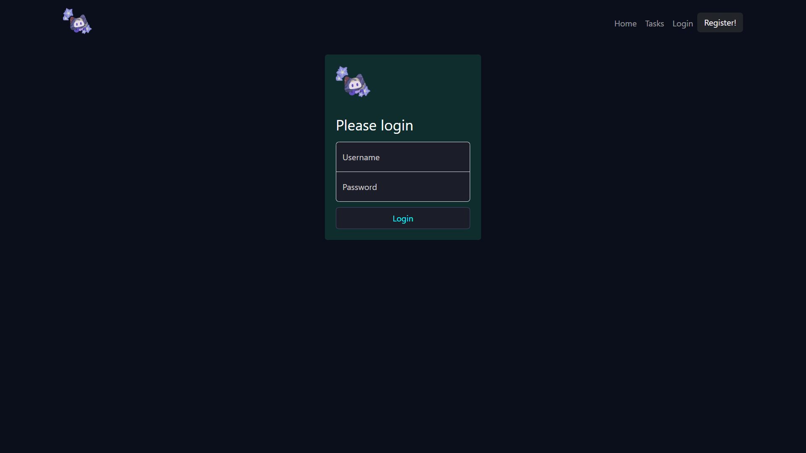
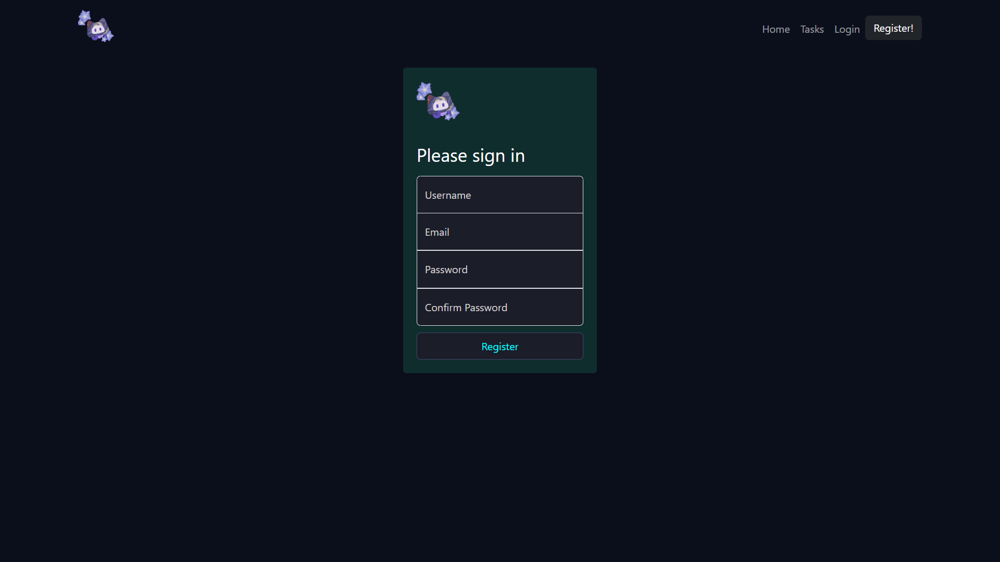
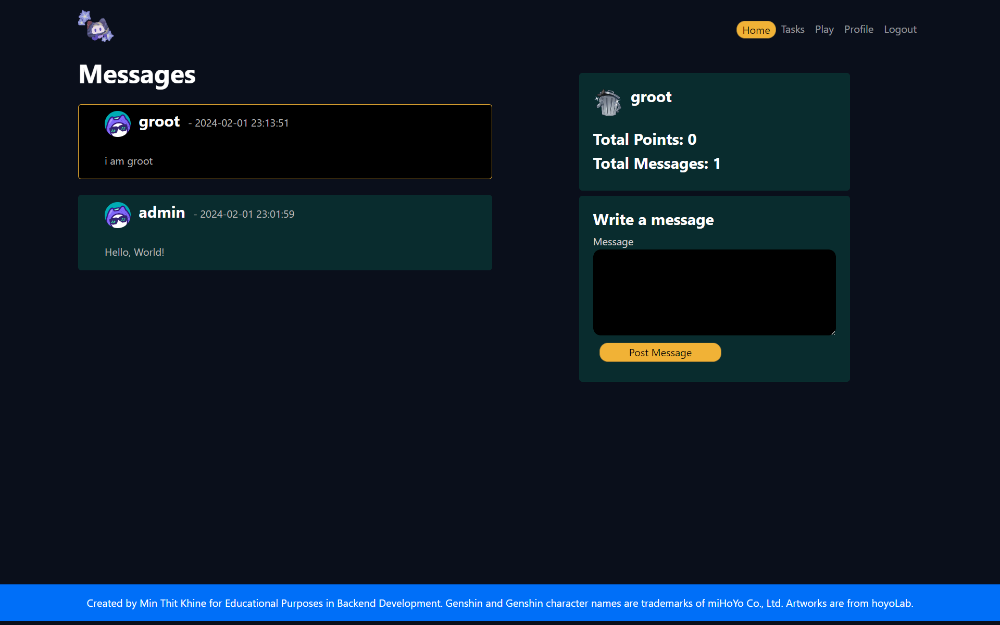
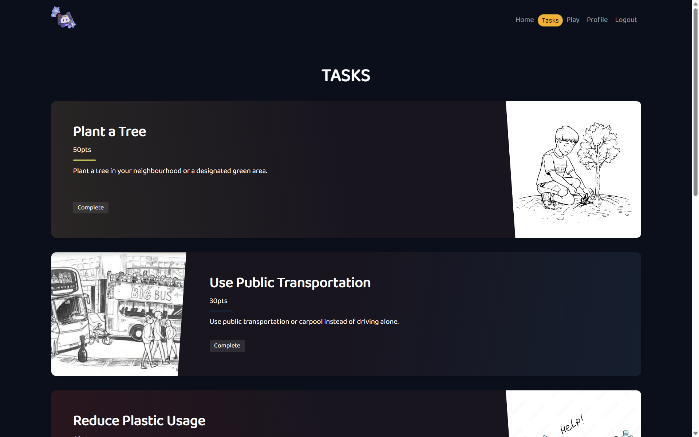
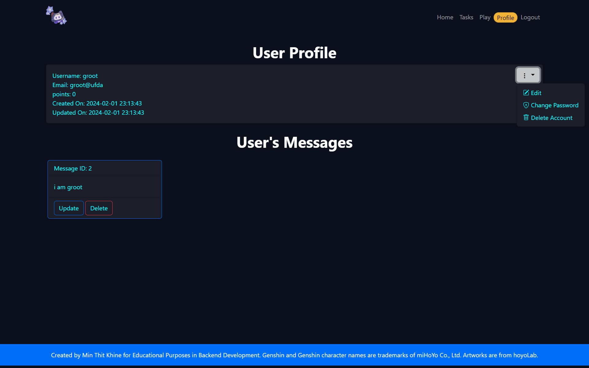

# BED CA2

Welcome to the Genshin Gacha Simulator! Our full-stack application is designed for fans of the Genshin Impact game who love the thrill of gacha pulls. Built with a robust backend using Express and MySQL, and a sleek frontend crafted with HTML, CSS, and JavaScript, our simulator offers an authentic and engaging gacha experience. Whether you're looking to simulate your next big in-game pull or just enjoy the gacha mechanics, our simulator is the perfect tool for fans to explore possible outcomes without spending a dime.

> **Notes :**
>
> The data and assets used for this Project are taken from [Hoyo Wiki](https://wiki.hoyolab.com/), [Genshin Fandom Wiki](https://genshin-impact.fandom.com/wiki/Genshin_Impact_Wiki), [Honey Impact](https://genshin.honeyhunterworld.com/) and recorded from the game itself with several modification.

## Getting Started

To begin using the Genshin Gacha Simulator, follow these simple steps:

1. **Clone the repository:**
   Start by cloning the project repository to your local machine using the following command:

   ```bash
   git clone https://github.com/ST0503-BED/bed-ca2-godlykira.git
   ```

2. **Install dependencies:**
   Next, install the required dependencies using the following command:

   ```bash
   cd bed-ca2-godlykira
   npm install
   ```

3. **Configure environment variables:**
   Finally, create the environment variables file and write the required variables:

   ```env
    DB_HOST=<HOST>
    DB_USER=<USERNAME>
    DB_PASSWORD=<PASSWORD>
    DB_DATABASE=<DATABASE>
    JWT_SECRET_KEY=<SECRET_KEY>
    JWT_EXPIRES_IN=<EXPIRES_IN>
    JWT_ALGORITHM=<ALGORITHM>
    SALT_ROUNDS=<SALT_ROUNDS>
   ```

4. **Run the server:**
   Finally, run the server using the following command:

   ```bash
   npm run init_tables
   npm start
   ```

   The server will start on port 3000.

   > **Note** For testing gacha. I recommand using the admin account ( username: admin, password: the same password as the database )

### Made with

[](https://nodejs.org 'Go to Node.js homepage')

### Dependencies

[](https://www.npmjs.com/package/express)
[](https://www.npmjs.com/package/express)
[](https://www.npmjs.com/package/express)
[](https://www.npmjs.com/package/express)
[](https://www.npmjs.com/package/express)
[](https://www.npmjs.com/package/express)

### Author

- Min Thit Khine

### Screenshots

#### Login Page



#### Register Page



#### Index Page



#### Task Page



#### User Profile Page



#### Game Main Page


#### Gacha Page


#### Inventory Page


#### Character Page


#### Weapon Page


## Features

### Section A

1. **Global Message** ( Users can post messages in the global chat while the non-logged in users can only see them )
2. **Tasks System**
3. **Customizable Profile** ( Users can customize their profile )

### Section B

4. **Gacha Wish Simulator** ( Users can engage in gacha on different banners )
5. The Pity System is designed to mimic the mechanics of the real game closely.
6. **Inventory System** ( Users can see the items that they already owned from the Gacha )
7.
8. **Character DB** Users can see the characters that are in the game
9. **Weapon DB** Users can see the weapons that are in the game

## Pity System

1. Probability for 4★ item on Character Event Wish

   - 4★ item guaranteed at `10` roll and promoted 4★ item guaranteed at `20` roll.
   - Base rate to get 4★ item is `5.1%`, guaranteed to get 4★ item at pity `10`

   | **Pity** |  1   |  2   |  3   |  4   |  5   |  6   |  7   |  8   |   9    | ≥10  |
   | -------: | :--: | :--: | :--: | :--: | :--: | :--: | :--: | :--: | :----: | :--: |
   | **Rate** | 5.1% | 5.1% | 5.1% | 5.1% | 5.1% | 5.1% | 5.1% | 5.1% | 52.55% | 100% |

2. Probability for 4★ item on Weapon Event Wish

   - 4★ item guaranteed at `10` roll and promoted 4★ item guaranteed at `20` roll.
   - Base rate to get 4★ item is `6.6%`, guaranteed to get 4★ item at pity `10`

   | **Pity** |  1   |  2   |  3   |  4   |  5   |  6   |  7   |  8   |   9    | ≥10  |
   | -------: | :--: | :--: | :--: | :--: | :--: | :--: | :--: | :--: | :----: | :--: |
   | **Rate** | 6.6% | 6.6% | 6.6% | 6.6% | 6.6% | 6.6% | 6.6% | 6.6% | 53.30% | 100% |

3. Wish Probability

   - 5★ Item guaranteed at `73` roll.

## References

[](./docs/credit.md)
